 PROZE20L Jakub Nerć – Lunar Lander

## Zasady i funkcjonalność

Celem gracza jest wylądowanie statkiem kosmicznym na płaskim terenie, 
różniącym się położeniem i otoczeniem w zależności od poziomu. 
Aby lądowanie zostało uznane za poprawne, 
należy wykonać je z prędkością wertykalną nie większą niż 2 m/s i prędkością horyzontalną nieprzekraczającą 0,5 m/s 
(warości ustala się w pliku konfiguracyjnym). 
Statek porusza się zgodnie z prawami fizyki, przy założeniu, 
że horyzontalnie nie występują żadne siły – statek jest bezwładny – 
natomiast wertykalnie podlega grawitacji o przyspieszeniu zdefiniowanym dla każdego poziomu.  
  
Zetknięcie z lądowiskiem z niepoprawną prędkością powoduje utratę życia. 
Utratą życia kończy się również lądowanie poza wyznaczonym terenem lub zderzenie z przeszkodą. 
Przeszkodami mogą być poruszające się horyzontalnie meteory, 
jak również przemieszczające się ku górze kule ognia wyrzucane przez wulkany.  
  
Kolejność poziomów, wszystkie stałe, ukształtowanie terenu, pozycja lądowiska, 
lokalizacje przeszkód i trajektorie ich lotów są zdefiniowane w plikach konfiguracyjnych. 
Plik ten znajduje się na zewnętrznym serwerze. Podczas każdego uruchamiania gry jest pobierany i odczytywany. 
Z tej samej lokalizacji pobierany jest również plik zawierający listę najlepszych wyników. 
Przy każdym uruchomieniu gry jego zawartość jest wczytywana. Jeśli podczas rozgrywki na liście pojawi się nowy rekord, 
lista ta jest aktualizowana i wysyłana na serwer. Możliwe jest również wczytanie plików lokalnych.  

W interfejsie przed włączeniem gry pojawia się stosowne okno, pozwalające na połączenie z serwerem lub na pracę z plikami lokalnymi. 
  
Sterowanie lokalizacją i prędkością statku odbywa się przy użyciu klawiatury. 
Klawisz strzałki w dół odpowiada za załączenie dolnych silników odrzutowych, 
strzałki w prawo oraz lewo za uruchomienie odpowiednich silników bocznych.   
  
Podczas gry gracz może mieć jednocześnie 5 żyć (definiowane w pliku konfiguracyjnym). Po utracie wszystkich następuje koniec gry i powrót do pierwszego poziomu. 
Dopóki gracz dysponuje życiami, może powtarzać aktualny poziom. 
Utracone życie można przywrócić na dwa sposoby: 
zaliczenie poziomu (poprawne wylądowanie) z poziomem paliwa większym niż 50% (definiowane w pliku konfiguracyjnym) lub zdobycie serduszka lewitującego 
w przestrzeni poprzez nalot na nie statkiem.   
  
Każde załączenie silnika wiąże się ze zużyciem paliwa, którego poziom maleje proporcjonalnie do czasu pracy silników. 
W razie potrzeby poziom paliwa można uzupełnić najeżdżając statkiem na lewitujący zbiornik z paliwem. 
Brak paliwa powoduje utratę sterowności statku i w konsekwencji poddanie go działaniu wyłącznie praw fizyki.  
  
Gra składa się ze zdefiniowanej w pliku konfiguracyjnym liczby poziomów, z których każdy jest tematycznie związany 
z jakąś odkrytą dotychczas planetą. Jeśli nie uniemożliwi to przejścia gry, 
wartości przyspieszenia grawitacyjnego w poszczególnych poziomach będą odpowiadały realnemu przyspieszeniu na danej planecie. 
Po przejściu ostatniego poziomu gra się kończy, a wynik punktowy gracza, jeśli tylko nie jest gorszy od 15 najlepszych rezultatów, 
zapisywany jest do listy najlepszych wyników wraz z nazwą gracza (*nick*). 
Lista ta jest przechowywana w pliku i wczytywana przy każdym uruchomieniu gry.  
  
Punkty w grze przyznawane są na każdym poziomie. Na wynik z danego poziomu składają się punkty za zaoszczędzone paliwo, 
czas lądowania oraz wartość prędkości tuż przed wylądowaniem. 
Maksymalnie za poziom można otrzymać 1250 punktów (za całą grę 10000 punktów).  
W zależności od czasu, poziomu paliwa oraz prędkości przy lądowaniu od tej wartości odejmowane są punkty według następujących zasad:  
- Czas lądowania (w sekundach): 100\*(*czas_ladowania* – 1) (pkt),  
- Pozostałe paliwo (w procentach): 10\*(100 – *pozostale_paliwo*) (pkt),  
- Prędkość wertykalna (w m/s): 50\**predkosc_wertykalna* (pkt),  
- Prędkość horyzontalna (w m/s): 10\**predkosc_horyzontalna* (pkt).  
- Punkty podawane są bez części ułamkowej. Minimalna ich liczba to 0, maksymalna 1250.  

## Opis interfejsu graficznego

Przedstawione grafiki mają charakter poglądowy.

### Ekran startowy

Po uruchomieniu gry oczom użytkownika ukazuje się ekran startowy, z czterema możliwymi opcjami do wyboru: *START*, *WYNIKI*, *ZASADY*, *KONIEC*: 
- Wybranie opcji *WYNIKI* powoduje otwarcie [okna wyników](#okno-wyników).  
- Wybranie opcji *ZASADY* powoduje otwarcie [okna zasad](#okno-zasad), prezentującego zasady gry i sposób jej przebiegu.  
- Wybranie opcji *KONIEC* ma takie samo działanie kliknięcie w systemowe pole zamykania okna i powoduje zamknięcie wszystkich okien gry.  
- Wybranie opcji *START* powoduje pokazanie się [okna wpisywania nazwy użytkownika](#okno-wpisywania-nazwy-użytkownika) z polem tekstowym, w które należy wpisać *nick* gracza. Od tej pory okno zawierające ekran startowy staje się nieaktywne, a elementy w nim zawarte niemożliwe do wybrania, dopóki inne okna gry nie zostaną zamknięte.  

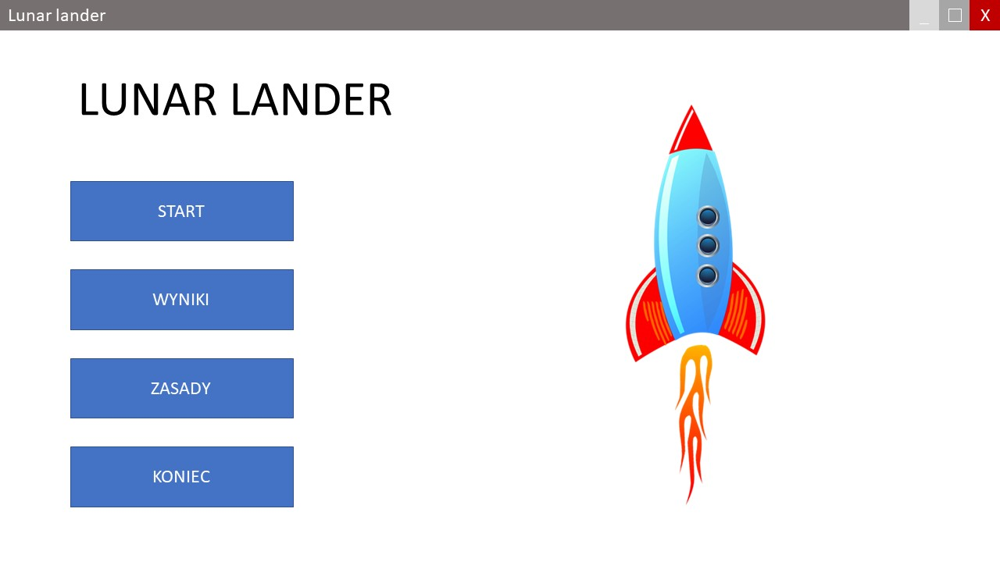

## Okno wyników

Przedstawia przewijalną listę 15 najlepszych wyników uzyskanych dotychczas przez graczy. 
Wybranie opcji *ZAMKNIJ* albo systemowego symbolu zamknięcia okna zamyka okno dialogowe i użytkownik powraca do [ekranu startowego](#ekran-startowy).  

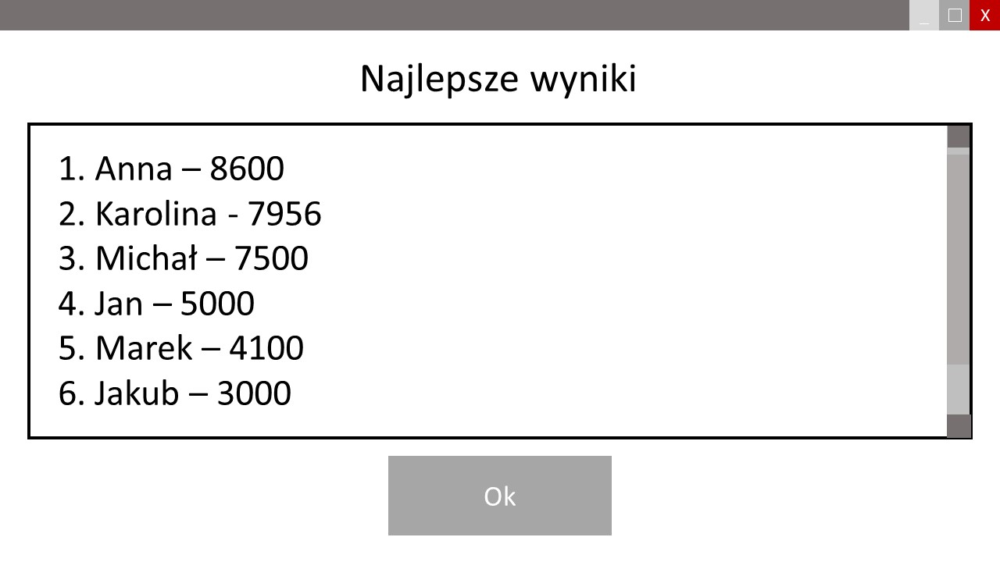

## Okno zasad

Okno dialogowe z możliwością przewijania treści, 
prezentującej zasady gry oraz jej przebieg. 
Przycisk *Wstecz* powoduje powrót do poprzedniego okna ([ekran startowy](#ekran-startowy) lub [okno pauzy](#okno-pauzy)).  

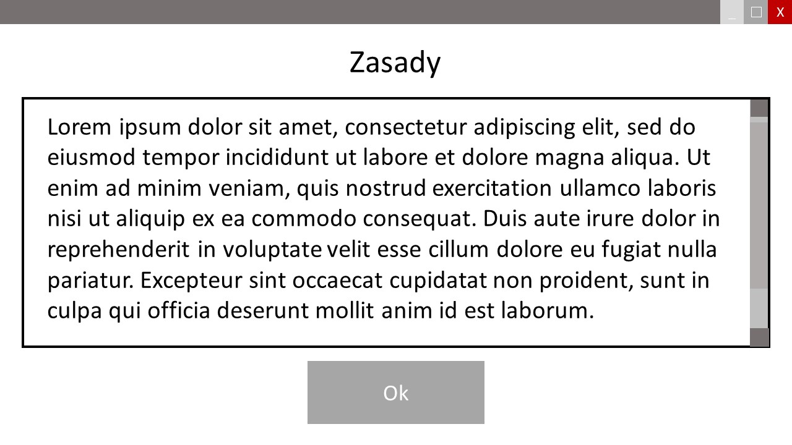

## Okno wpisywania nazwy użytkownika

Dopóki w polu tekstowym nie zostanie wprowadzona nazwa, przycisk *Ok* jest nieaktywny. 
Gdy w polu pojawi się wartość, przycisk *Ok* uaktywnia się, 
a jego kliknięcie powoduje wprowadzenia nazwy użytkownika do gry, 
zamknięcie okna wpisywania nazwy użytkownika i przejście do [okna rozpoczęcia gry](#okno-rozpoczęcia-gry). 
Kliknięcie przycisku *Anuluj* powoduje zamknięcie okna i powrót do [ekranu startowego](#ekran-startowy).  

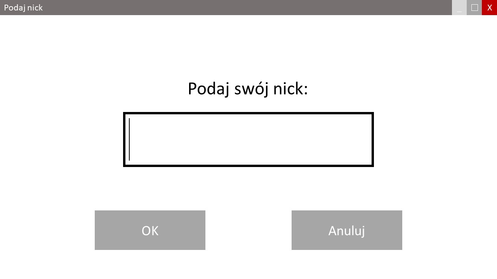

## Okno rozpoczęcia gry

Jest to okno dialogowe prezentujące skrócony opis podstawowych zasad gry. 
Wybranie opcji *Wstecz* powoduje powrót do [okna wpisywania nazwy użytkownika](#okno-wpisywania-nazwy-użytkownika). 
Opcja *Rozpocznij* powoduje otwarcie właściwego [okna gry](#okno-gry), 
przysłoniętego oknem dialogowym informującym o aktualnym poziomie. 
Opcja *Zakończ* powoduje powrót do [ekranu startowego](#ekran-startowy).  

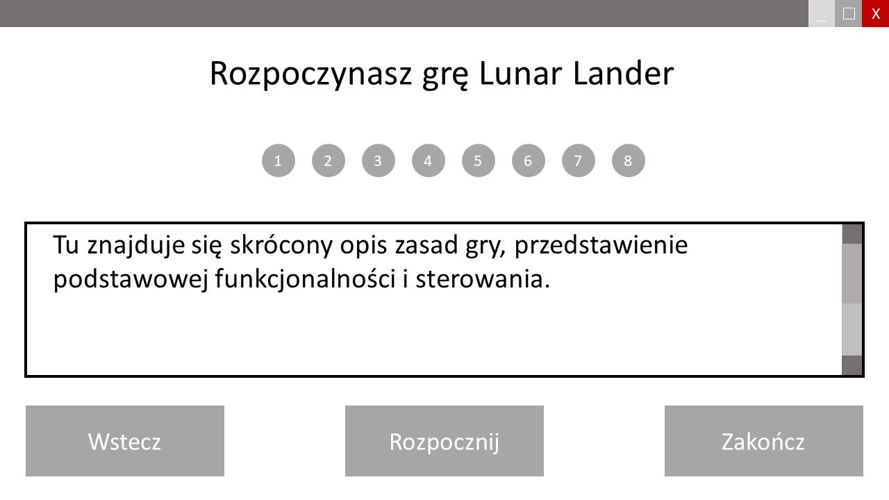

## Okno informacji o aktualnym poziomie

Okno dialogowe pojawiające się przed rozpoczęciem danego poziomu. 
Informuje o postępach (zielone planety to poziomy, które użytkownik przeszedł, czerwona planeta to aktualny poziom, 
planety szare to poziomy czekające użytkownika) oraz pozwala użytkownikowi przygotować się do rozpoczęcia gry. 
Przycisk *Start* powoduje przejście do [okna gry](#okno-gry). Przycisk *Zakończ* powoduje zakończenie gry, 
wraz z utratą wszystkich dotychczas zdobytych punktów i powrót do [ekranu startowego](#ekran-startowy). 
W razie potrzeby gracz może przejść do [okna zasad](#okno-zasad) klikając odpowiedni przycisk.  

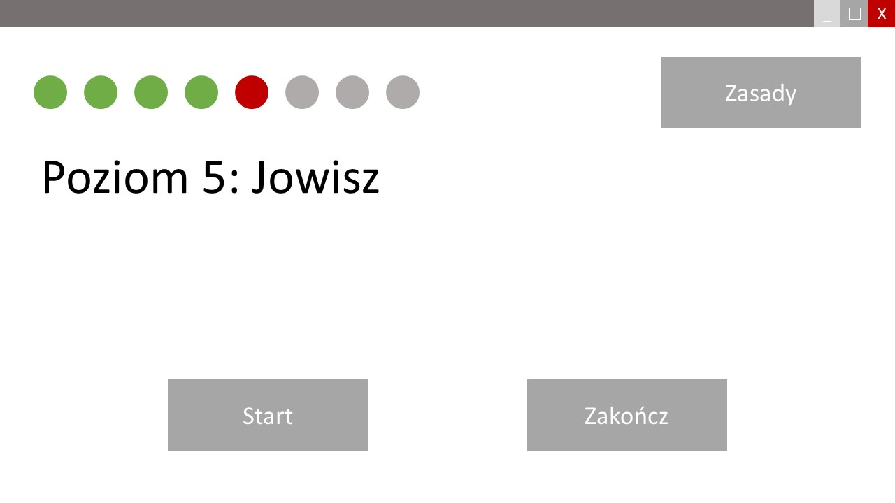

## Okno gry

Okno, w którym użytkownik musi przejść dany poziom gry. 
W prawym górnym rogu ikony serduszek symbolizują liczbę żyć gracza. 
Serduszka wypełnione to pozostałe życia, serduszka puste to życia stracone. 
Poniżej znajduje się wskaźnik poziomu paliwa. 
W lewym górnym rogu przycisk *Pauza* pozwala na chwilowe zatrzymanie gry i wywołanie [okna pauzy](#okno-pauzy). 
Poniżej czerwone koło pokazuje, który poziom jest rozgrywany. 
Użytkownik może też obserwować czas przechodzenia poziomu oraz aktualną prędkość. 
Widniejące na planszy strzałki symbolizują ruch i animację obiektów, przy których się znajdują.  

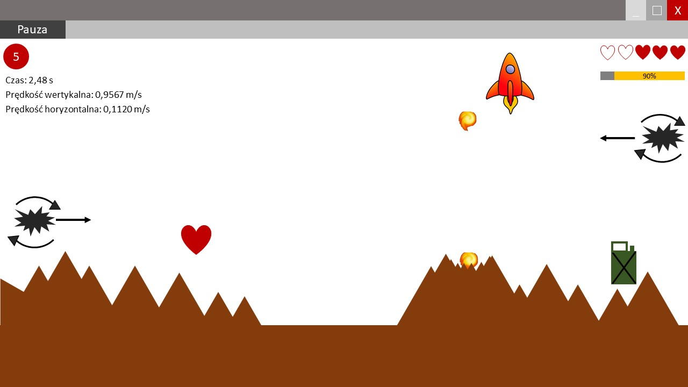

## Okno pauzy

Ma wygląd analogiczny do [okna informacji o aktualnym poziomie](#okno-informacji-o-aktualnym-poziomie), z tą różnicą, 
że przycisk *Start* został zastąpiony przyciskiem *Kontynuuj*, powodującym [powrót do rozgrywki](#okno-gry). 
W razie potrzeby gracz może przejść do [okna zasad](#okno-zasad) klikając odpowiedni przycisk.  

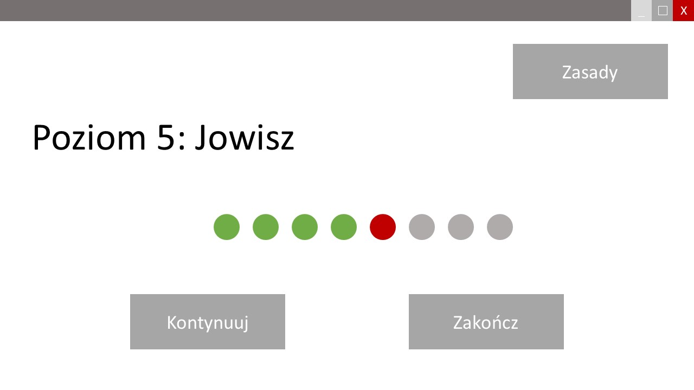

## Okno wygranej poziomu

Pojawia się po udanym wylądowaniu. 
Prezentuje czas przejścia poziomu, pozostałą liczbę żyć, uzyskane w poziomie punkty oraz sumę punktów dotychczas uzyskanych. 
Przycisk *Dalej* pozwala na przejście do [kolejnego poziomu](#okno-informacji-o-aktualnym-poziomie). 
Przycisk *Zakończ* umożliwia zakończenie gry, bez zapisu zdobytych punktów i przejście do [ekranu startowego](#ekran-startowy).  

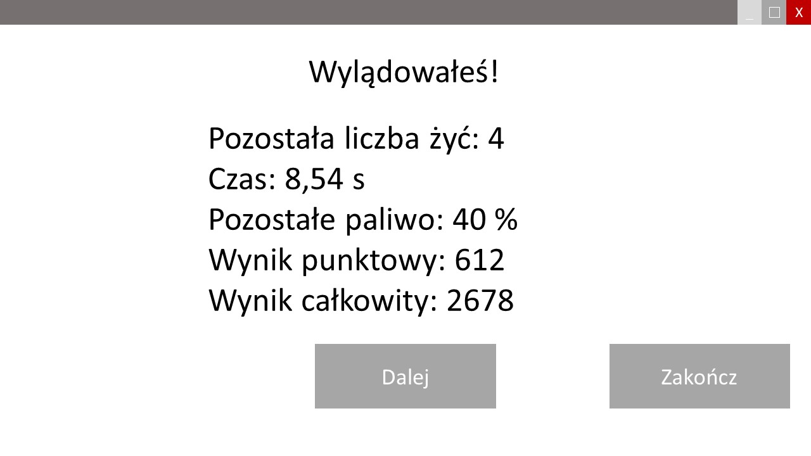

## Okno przegranej poziomu

Jest analogiczne do [okna wygranej poziomu](#okno-wygranej-poziomu). Pojawia się, jeżeli graczowi mimo przegranej pozostało co najmniej jedno życie. 
Umożliwia [powtórzenie poziomu](#okno-informacji-o-aktualnym-poziomie) przyciskiem Powtórz lub zakończenie gry przyciskiem *Zakończ* i powrót do [ekranu startowego](#ekran-startowy).  

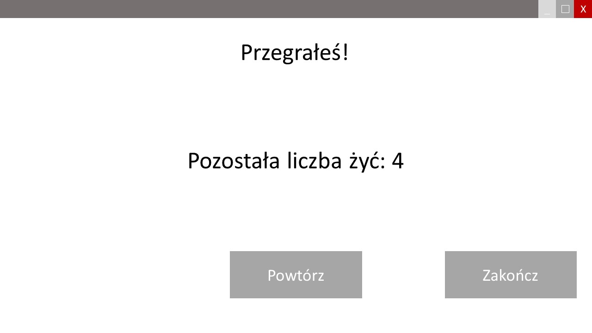

## Okno wygranej gry

Pojawia się po przejściu ostatniego poziomu. Przycisk *Powrót* do ekranu startowego zamyka okna gry i powoduje przejście do [ekranu startowego](#ekran-startowy).  

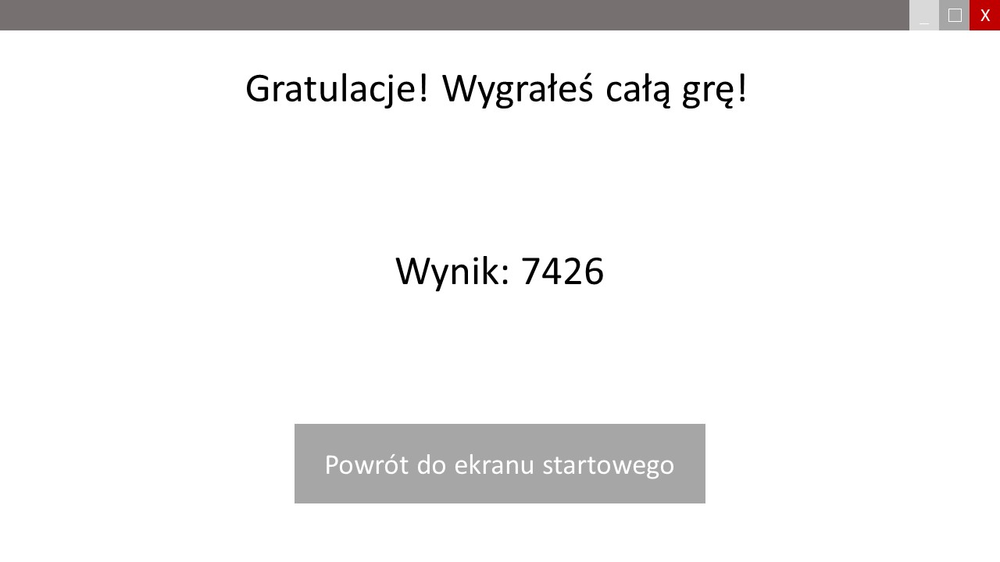

## Okno przegranej gry

Pojawia się po utracie przez gracza ostatniego życia. Podsumowuje dotychczas uzyskane punkty. 
Przycisk *Powrót* do ekranu startowego zamyka okna gry i powoduje przejście do [ekranu startowego](#ekran-startowy). 
Przycisk *Spróbuj ponownie* powoduje [rozpoczęcie gry od pierwszego poziomu](#okno-rozpoczęcia-gry).  

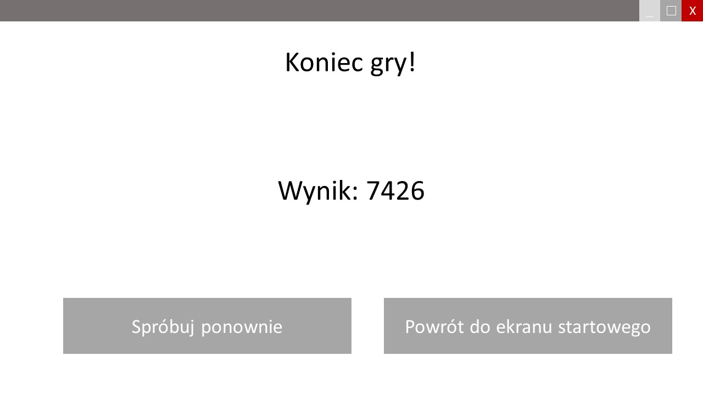

[]: #ekran-startowy